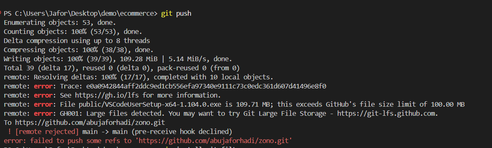

# Home Page Clone - Frontend Task for Backbencher Studio

This project is a **clone of the Zuno Template Home Page (Home 02)**, built using **Next.js (App Router)** as part of the Front-end Developer selection task at Backbencher Studio.  

The goal is to replicate the layout, styling, and functionality of the original site as closely as possible.

---

## Live Demo

You can view the hosted project here: [https://zuno25.vercel.app/](https://zuno25.vercel.app/)

---

## Features Implemented

- Header with navigation
- Hero section with image and call-to-action
- Key sections cloned from the original design
- Responsive layout using **Tailwind CSS**
- Footer section

> Note: The project may not cover the full page, but all implemented sections maintain visual fidelity to the original template.

---

## Technologies Used

- **Next.js 15+ (App Router)**
- **React.js**
- **Tailwind CSS**
- **Git** for version control
- **Vercel** for hosting

---

## Getting Started

1. Navigate to the project folder:

```bash
cd app
````

2. Install dependencies:

```bash
npm install
# or
yarn install
```

3. Start the development server:

```bash
npm run dev
# or
yarn dev
```

4. Open [http://localhost:3000](http://localhost:3000) in your browser.

---

## Folder Structure (App Router)

```
/app          -> Next.js App Router pages and layouts
/components   -> Reusable React components
/public       -> Static assets (images, icons)
/styles       -> Tailwind CSS or global styles
```

---

## Submission Details

* **Source Code:** [ https://github.com/abujaforhadi/zono.git]( https://github.com/abujaforhadi/zono.git)
* **Live Hosted Site:** [https://zuno25.vercel.app/](https://zuno25.vercel.app/)

---

## Author

**Md. Abu Jafor**
[Portfolio](https://abujafor.me) | [GitHub](https://github.com/abujaforhadi) | [LinkedIn](https://www.linkedin.com/in/abujaforhadi)

**Certain commits were removed to resolve Git push errors caused by large files.**
